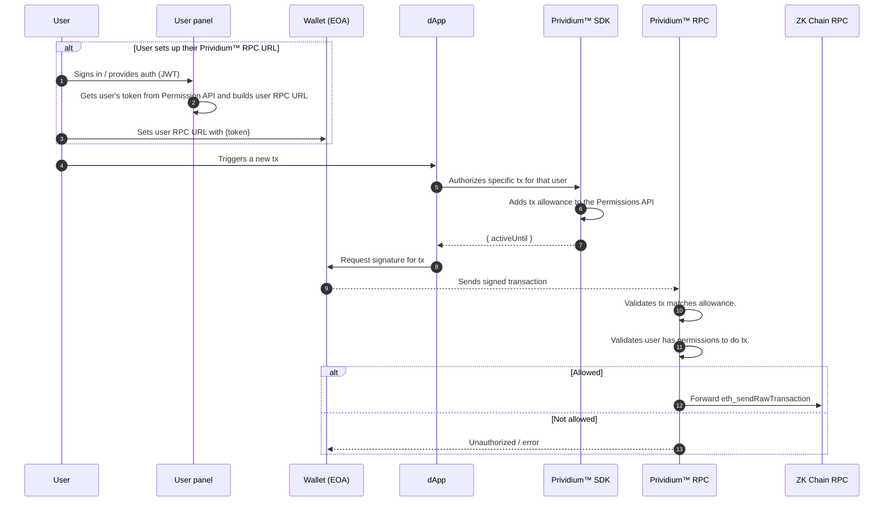

## What it is (Overview)

Prividium™ exposes a per-user RPC endpoint that embeds a user-scoped token in the RPC URL. This enables wallets and
dapps to call JSON-RPC without attaching a bearer JWT on every request, while still enforcing user-level authorization
and transaction constraints through the Permissions API.

- The per-user RPC endpoint is `POST` at: `/rpc/wallet/{token}` (served by the Prividium™ api)
- The token is issued by the Permissions API and stored per user
- Prividium™ api validates the token and enforces transaction allowances before delegating to the target RPC

## End-to-end sequence of a transaction using the per-user RPC URL

## Token lifecycle

1. Issue or fetch user’s token (auth required):
   - `GET /api/wallet/personal-rpc-token`
   - If none exists, one is generated and stored on the user record
2. Rotate/Invalidate token (auth required):
   - `POST /api/wallet/invalidate`
   - Generates and stores a new token; previous token becomes invalid
3. Validate token (public; no JWT):
   - `GET /api/wallet/validate-token/{token}` → returns associated `userId` or 401

Token format: 16 hex characters (64 bits of entropy) generated via `randomBytes(8).toString('hex')`.

## Wallet RPC behavior (mocked and filtered)

For privacy and policy enforcement, the wallet RPC route restricts and/or mocks certain methods:

- `eth_getBlockByNumber`: returns a real block number, while other block fields are mocked and the transactions list is
  always empty.
- `eth_getBlockByHash`: returns a mocked block; transactions include only the allowance’s transaction hash (if present),
  and that hash is marked as seen to prevent later receipt access.
- `eth_getTransactionReceipt`: returns a receipt only for the stored transaction hash and only until it is marked seen;
  otherwise returns null.
- `eth_getCode`: returns '0x' for the allowance wallet address (EOA), and a dummy code for any other address (treated as
  contracts).
- Many other methods are forbidden to avoid data leakage and side‑channel discovery (e.g., eth_estimateGas,
  eth_getTransactionCount, eth_call, logs/filters, etc.).

## Transaction allowances

Allowances restrict what a token can do on-chain for a limited time window.

- Authorize a transaction (auth required):
  - `POST /api/wallet/authorize-transaction`
  - Body includes: `walletAddress`, `contractAddress`, `nonce`, `calldata`, `value`
  - Active for 1 hour from creation
  - Purpose: pre‑authorizes a single transaction shape for a short window, binding the user’s wallet, target contract,
    nonce, calldata, and value. Required before submitting the signed transaction via the per‑user RPC URL.
- Read latest active allowance (public):
  - `GET /api/wallet/transaction-allowances/{token}`
  - Purpose: returns the most recent still‑active allowance for the given token. Used by the Proxy to enforce rules and
    by clients to display status or verify whether a transaction is currently permitted.
- Update tx hash (public):
  - `POST /api/wallet/update-transaction-hash/{token}`
  - Purpose: lets the Proxy (or a trusted client) record the actual on-chain transaction hash for the active allowance
    after a successful submission. This ties the allowance to a concrete tx and enables the subsequent privacy behavior
    (e.g., exposing only that hash in mocked block data).
- Mark hash seen (public):
  - `POST /api/wallet/set-hash-seen/{token}`
  - Purpose: marks the stored transaction hash as “seen” once it has been revealed (e.g., via a mocked block response),
    which causes later `eth_getTransactionReceipt` calls to return `null`. This prevents ongoing data leakage and limits
    observability after the initial disclosure.

Wallet RPC handlers in the Proxy enforce allowances. For example, balance queries are allowed only for the wallet
address in the allowance, and raw transactions are checked against the enabled `from`, `to`, `nonce`, and `calldata`.

### Allowance flow (step-by-step)

1. Authorize: client (with user auth) calls api `POST /api/wallet/authorize-transaction` with `walletAddress`,
   `contractAddress`, `nonce`, `calldata`, `value`. The Permissions API stores an allowance active for 1 hour.
2. Submit tx: dapp calls api `POST /rpc/wallet/{token}` with `eth_sendRawTransaction`.
   - Prividium™ api decodes tx to `from`, `to`, `nonce`, `calldata` and checks exact match against the latest active
     allowance.
3. On success: Prividium™ api forwards to target RPC and stores the resulting `transactionHash` on the allowance.
4. Post‑tx reads: `eth_getBlockByHash` returns only the stored tx hash and sets `hash_seen=true`. After that,
   `eth_getTransactionReceipt` returns `null` (prevents further leakage).
5. Expiry: When `activeUntil` passes or no allowance exists, wallet RPC calls become unauthorized/empty; public endpoint
   `GET /api/wallet/transaction-allowances/{token}` returns `allowance: null`.

## Using it (SDK and User Panel)

- **Prividium™ SDK**: `getWalletToken()` and `getWalletRpcUrl()` helpers
  - `getWalletRpcUrl()` derives `${PERMISSION_API_URL}/rpc/wallet/{token}` from the configured `rpcUrl`
- **User Panel**: Fetches token and offers “Add Network to Wallet”, passing the
  `${PERMISSION_API_URL}/rpc/wallet/{token}` as the RPC URL to the wallet

## Enabling via configuration

- Disabled by default: the per-user wallet RPC routes are not exposed unless explicitly enabled.
- How to enable:
  - Set the Prividium™ API configuration flag to true (environment variable `WALLETS_API_ENABLED=true`).
  - When enabled, the Prividium™ API registers:
    - `POST /rpc/wallet/{token}` (wallet RPC endpoint)
    - Proxied permissions routes under `/permissions` for convenience: `/wallet/personal-rpc-token` and
      `/wallet/invalidate`.

## Security considerations

- Token is a bearer secret. Treat it like a password in URLs (rotate if leaked).
- 64-bit entropy (16 hex chars). Use HTTPS to prevent interception.
- Tokens do not expire automatically; rotation replaces the previous token.
- Transaction allowances significantly limit what can be performed via the tokenized RPC by binding specific
  `walletAddress`, `contractAddress`, `nonce`, and `calldata`, and by time window.
